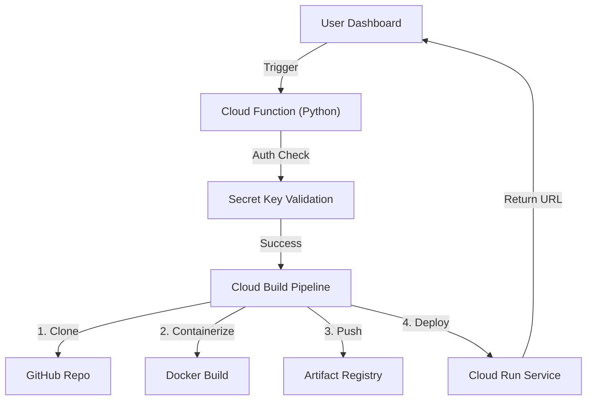

# ☁️ Chandra Cloud Ecosystem

  

**Chandra Cloud** is a comprehensive SaaS infrastructure platform designed to democratize cloud deployment. It combines a high-performance **Deployment-as-a-Service** engine with essential business operation modules (HR, Inventory, Commerce), all powered by Google Cloud Platform (GCP).
---
## 🚀 Key Features

### 1. Zero-Touch AI Deployment (`deploy-ai-manager`)
A serverless orchestration engine that converts a GitHub Repository into a live, scalable web application in under 60 seconds.
- **Tech:** Google Cloud Build, Cloud Run, Artifact Registry.
- **Security:** RBAC with proprietary `Secret_Key` validation.
- **Scalability:** Auto-scales to zero to minimize costs.

### 2. Enterprise Operations Suite
- **HR_Tool (HR Module):** Complete workforce management with Kanban task boards, recruitment pipelines, and payroll tracking.
- **AgFlow (Asset Exchange):** A universal inventory management system supporting physical crops, digital assets (code), and media.
- **Thug-Ride Inventory:** A luxury asset showcase template with high-performance UI.

---

## 🏗️ Architecture

🛠️ Installation & Setup
Prerequisites
• Google Cloud Platform Account
• Python 3.9+
• Google Cloud SDK (gcloud)

1. Backend Setup (The Orchestrator)
Navigate to the deploy-ai-manager directory and deploy the function:
cd deploy-ai-manager
gcloud functions deploy deploy_trigger \
  --runtime python311 \
  --trigger-http \
  --allow-unauthenticated \
  --region us-central1

2. Frontend Configuration
Update the deploy-dashboard.html file with your triggered Cloud Function URL:
const CLOUD_FUNCTION_URL = "https://YOUR_REGION-YOUR_PROJECT.cloudfunctions.net/deploy_trigger";

💻 Usage
1. Launch the Portal: Open index.html in your browser.
2. Deploy an App:
• Go to the "Hustle Hub" or "Console".
• Enter a valid GitHub Repo URL.
• Enter your CHANDRA_VIP license key.
• Click Deploy.
3. Manage Business: Use the sidebar to access HR_Module or AgFlow for day-to-day operations.
📊 Revenue Model & Business Value
This project is designed with a sustainable revenue model:
• SaaS Subscription: Monthly recurring revenue for access to HR & Inventory tools.
• Compute Metering: Margins on Cloud Run usage for deployed AI apps.
• Licensing: Enterprise licensing of the deployment engine.

📄 License
Copyright © 2025 Chandra Cloud Empire. All Rights Reserved.
